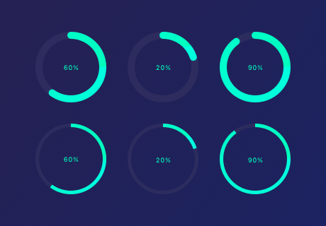
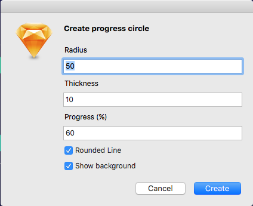

#Radial Progress Bar
This plugin for Sketch makes it super easy to create circular progress bars. It generates nice clean vector paths that you can style however you want.

You can:
* Set the radius
* Set the progress in %
* Set the width of the line
* Show a background or not
* Round the ends of the line or not

#Full vector paths
It creates a clean vector path, so you don't need to worry when you scale or move it that it's going to be messed up.

#Installation
Download the zip and double click the .sketchplugin file. This will install the plugin automatically
